  

 

I build retrieval systems that turn unstructured data into something production can depend on. Currently AI Engineer at **XNode AI**, working on an enterprise information catalog that unifies metadata across PostgreSQL and five other sources — 100K+ data assets, lineage-tracked, behind CI/CD.

- **Building** — entity and relationship extraction into Neo4j and Graphiti, running alongside the vector layer instead of replacing it. Vector search finds what a document *says*; a graph keeps how things *relate*.
- **Learning** — where the graph-ingestion token cost actually pays for itself. You pay once at ingestion instead of at every query, and that only earns out if enough queries are relational.
- **Open to** — conversations about RAG that has to survive contact with real data.

 

  

 

  
  

  

 

### Selected work

**[LangGraph Agentic Platform](https://github.com/HarianthK/Langgraph-agent-automation)** — A multi-agent system for supply chain resilience: real-time news analytics, geospatial risk scoring, automated alerting. I designed the orchestration layer — state management, tool routing, memory, and the LLM decision loops.

**[Registry Points](https://registry-points.vercel.app)** — A lookup over the World Swing Dance Council's competitor registry. Type-ahead search and record lookup, points totalled by division, eligibility resolved. ([code](https://github.com/HarianthK/Registry-points))

**[Portfolio](https://github.com/HarianthK/Portfolio)** — My own work modelled as the kind of knowledge graph I build for a living. Next.js, TypeScript, a hand-rolled force layout. ([live](https://harianthk.vercel.app))

### Elsewhere

[harianthk.vercel.app](https://harianthk.vercel.app) · [LinkedIn](https://www.linkedin.com/in/harianthk/) · [hkalaval@asu.edu](mailto:hkalaval@asu.edu)
